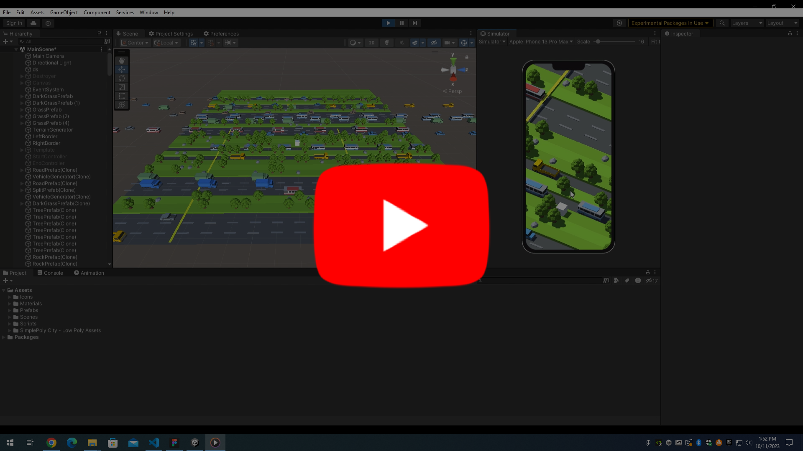

# Crossby Road

## Demo

    

## Screenshot

    
    
    

## Phase 1: Concept and Design

<!-- Brainstorm a concept for your VR experience, drawing inspiration from the articles.
Sketch a basic design for your virtual environment, considering elements like nature, Earth, space, wildlife, humanity, and the emotional impact you want to convey. -->

Inspired of following game, Crossy Road, I decided to develop the endless hopper mobile game similar to it. I will implement some basic functionalities of the game, such as grass terrain, road terrain, vehicle, player, and user interface including button, score, and high score.

<blockquote>
Crossy Road is the 8-bit endless arcade hopper that started it all. Collect custom characters and navigate freeways, railroads, rivers and much more.
</blockquote>

    <a href="https://www.crossyroad.com/">https://www.crossyroad.com/</a>

 

    

https://play.google.com/store/apps/details?id=com.yodo1.crossyroad&hl=en_US&gl=US  
https://apps.apple.com/us/app/crossy-road/id924373886

## Phase 2: Asset Compilation

<!-- Use readily available 3D models, textures, and assets (or create simple ones) to build your virtual environment.
Ensure that the assets align with your chosen theme and design. -->

    

https://assetstore.unity.com/packages/3d/environments/simplepoly-city-low-poly-assets-58899

    

https://assetstore.unity.com/packages/audio/sound-fx/free-casual-game-sfx-pack-54116

## Phase 3: Game Development

<!-- Using the Unreal Engine VR Template, begin constructing your first environment.
Implement basic user interactions, such as the ability to look around and navigate the space. -->

### 1. Player

<a href="/Assets/Scripts/PlayerController.cs">🔥 PlayerController.cs</a>

### 2. Camera

<a href="/Assets/Scripts/CameraController.cs">🔥 CameraController.cs</a>

### 3. Border

<a href="/Assets/Scripts/BorderController.cs">🔥 BorderController.cs</a>

### 4. Terrain

<a href="/Assets/Scripts/TerrainGenerator.cs">🔥 TerrainGenerator.cs</a>

### 5. Vehicle

<a href="/Assets/Scripts/VehicleGenerator.cs">🔥 VehicleGenerator.cs</a>  
<a href="/Assets/Scripts/VehicleController.cs">🔥 VehicleController.cs</a>

## Phase 4: Emotional Impact

<!-- Students will focus on creating an emotional impact in their VR experience, drawing from the readings.
Consider using lighting, sound, and storytelling elements to evoke specific emotions within users. -->

## Phase 5: Testing and Iteration

<!-- Test your VR experience to ensure it runs smoothly and effectively.
Gather feedback from peers and make necessary adjustments to enhance the user experience. -->

### 1. Optimization

Too many objects are remain undestroyed even though they are not visible to the player. The first step to optimize user experience is to render only the object that is visible to the player. Considering the characteristic of the player and the camera, I will precisely designed the transform of the destroyer object, which destroys every object that collides to it.

### 2. User Interface, and User Experience

Although the key functionalities such as player, camera, grass, road, and vehicle are implemented, we need to design some user interface and user experience in order to create an user friendly gameplay environment.

First, I will implement start screen and end screen. Whenever the player is destroyed, The black background with game logo fades in. After short loading, the black background with game logo fades out, therefore creating a natural transition between two different games.

Second, I will implement score and best score user interface. The score will be calculated as number of terrain passed + number of road in which the player have destoryed any car. The best score will be implemented with PlayerPrefs API in unity.

Third, I will implement pause and resume button. If pause button pressed, the time scale of game is set to 0. Also, half transparent black background appears in order to give user the feeling of game is actually paused. If resume button pressed, the time scale of game is set to 0. And, half transparent black background disappears.

### 3. Sound

Currently, there is no sound at all. I will add some casual sound into the game in order to increase the completeness. There will be four different kind of sounds, which are jump audio, car destroy audio, score audio, and player destroy audio. Each audio will be played in appropriate situation.

## Phase 3: Game Development

<!-- Using the Unreal Engine VR Template, begin constructing your first environment.
Implement basic user interactions, such as the ability to look around and navigate the space. -->

### 1. Optimization

<a href="/Assets/Scripts/Destroyer.cs">🔥 Destroyer.cs</a>  
<a href="/Assets/Scripts/DestroyerController.cs">🔥 DestroyerController.cs</a>

### 2. User Interface, and User Experience

#### 1) Start, and End Screen

<a href="/Assets/Scripts/StartController.cs">🔥 StartController.cs</a>  
<a href="/Assets/Scripts/EndController.cs">🔥 EndController.cs</a>

#### 2) Score, and Best Score

<a href="/Assets/Scripts/ScoreController.cs">🔥 ScoreController.cs</a>  
<a href="/Assets/Scripts/BestScoreController.cs">🔥 BestScoreController.cs</a>

#### 3) Pause, and Resume Button

<a href="/Assets/Scripts/PauseController.cs">🔥 PauseController.cs</a>

### 5. Sound

<a href="/Assets/Scripts/PlayerController.cs">🔥 PlayerController.cs</a>  
<a href="/Assets/Sounds/">🔥 Sounds/</a>

## Phase 4: Emotional Impact

<!-- Students will focus on creating an emotional impact in their VR experience, drawing from the readings.
Consider using lighting, sound, and storytelling elements to evoke specific emotions within users. -->

## Phase 6: Documentation and Presentation

<!-- Create documentation, including a brief project description, screenshots of your experience, a list of assets used, and a reflection on the emotional impact you aimed to achieve.
Present your VR experiences to the class, sharing your inspirations and insights. -->

### 1. How to Play

#### 1) Android

Install https://github.com/hoosong0235/Crossby-Road/releases/tag/v1.1.0

### 2. Reference

#### 1) Crossy Road

https://www.crossyroad.com/  
https://play.google.com/store/apps/details?id=com.yodo1.crossyroad&hl=en_US&gl=US  
https://apps.apple.com/us/app/crossy-road/id924373886

#### 2) Asset

https://assetstore.unity.com/packages/3d/environments/simplepoly-city-low-poly-assets-58899  
https://assetstore.unity.com/packages/audio/sound-fx/free-casual-game-sfx-pack-54116
